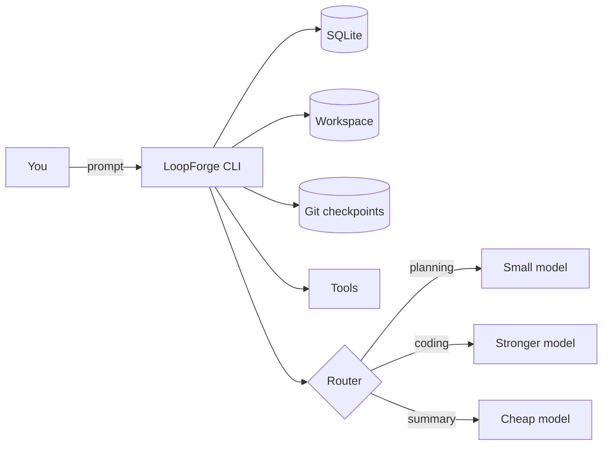

<div class="rexos-hero" markdown>

# LoopForge

**Long-running Agent OS**: harness + SQLite memory + sandboxed tools + multi-provider routing.

[Get started](tutorials/quickstart-ollama.md){ .md-button .md-button--primary }
[Quick intro](blog/what-is-loopforge.md){ .md-button }
[Providers](how-to/providers.md){ .md-button }

<p class="rexos-muted">
Start local with Ollama. Switch to GLM / MiniMax / DeepSeek / Kimi / Qwen / NVIDIA NIM when you need more power.
</p>

</div>

> Brand update: LoopForge is the new name (formerly RexOS). CLI is `loopforge`; config stays in `~/.rexos`.

<div class="grid cards" markdown>

- :material-checklist: **Harness for long tasks**
  Run "change → verify → checkpoint" repeatedly.
  [Learn more](tutorials/harness-long-task.md)

- :material-database: **SQLite memory**
  Sessions and messages live in `~/.rexos/rexos.db`.
  [Concepts](explanation/concepts.md)

- :material-shield-lock: **Sandboxed tools**
  File IO and shell stay in workspace; web_fetch has SSRF protection.
  [Security](explanation/security.md)

- :material-router: **Multi-provider routing**
  Route planning/coding/summary to different models.
  [Providers](how-to/providers.md)

</div>

## Quickstart

=== "macOS/Linux"
    ```bash
    # 1) Start Ollama
    ollama serve

    # 2) Init LoopForge
    loopforge init

    # 3) Run a session
    mkdir -p my-work
    loopforge agent run --workspace my-work --prompt "Create hello.txt with: Hello LoopForge"
    ```

=== "Windows (PowerShell)"
    ```powershell
    # 1) Start Ollama
    ollama serve

    # 2) Init LoopForge
    loopforge init

    # 3) Run a session
    mkdir my-work
    loopforge agent run --workspace my-work --prompt "Create hello.txt with: Hello LoopForge"
    ```

## How It Works



## Next Steps

- [Harness tutorial](tutorials/harness-long-task.md)
- [Providers & routing](how-to/providers.md)
- [FAQ](how-to/faq.md)
