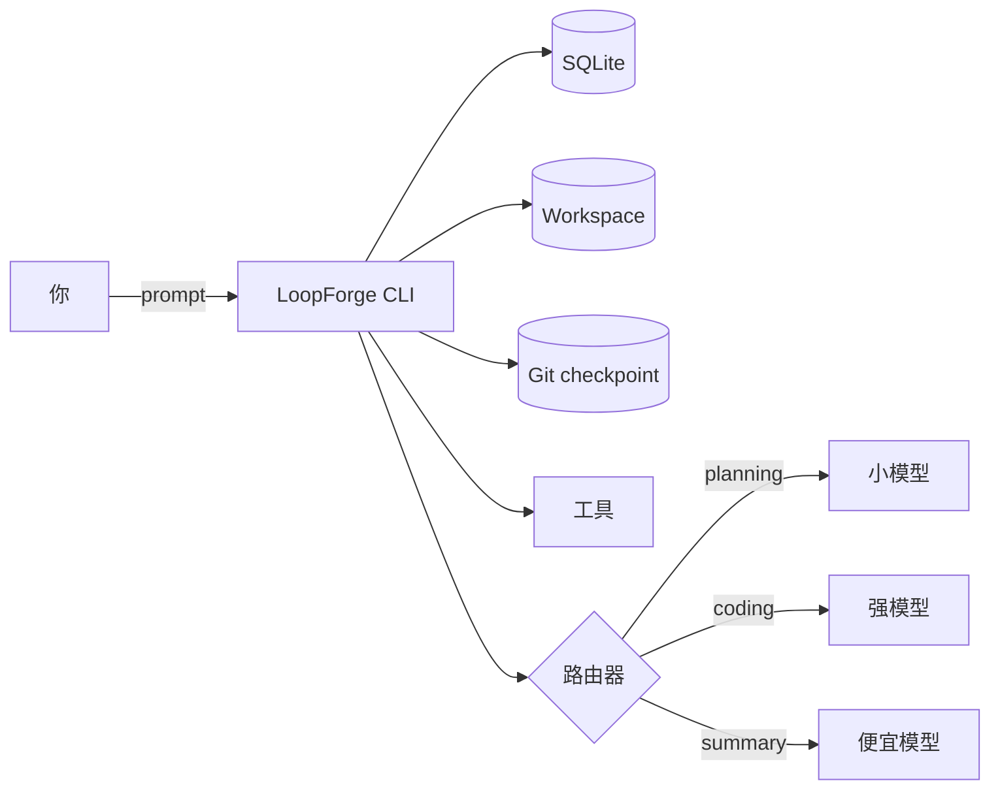

<div class="rexos-hero" markdown>

# LoopForge

**长任务 Agent OS**：harness + SQLite 记忆 + 工具沙盒 + 多 Provider 路由。

[快速开始](tutorials/quickstart-ollama.md){ .md-button .md-button--primary }
[简单介绍](blog/what-is-loopforge.md){ .md-button }
[Provider 配置](how-to/providers.md){ .md-button }

<p class="rexos-muted">
本地用 Ollama 先跑通；需要更强能力时，切到 GLM / MiniMax / DeepSeek / Kimi / Qwen / NVIDIA NIM。
</p>

</div>

> 品牌升级：LoopForge（原 RexOS）。CLI 命令是 `loopforge`，配置目录还是 `~/.rexos`。

<div class="grid cards" markdown>

- :material-checklist: **Harness 长任务**
  跑「改一下 → 跑一下 → 对了继续」的循环。
  [了解 Harness](tutorials/harness-long-task.md)

- :material-database: **SQLite 记忆**
  session 和 message 存在 `~/.rexos/rexos.db`。
  [概念](explanation/concepts.md)

- :material-shield-lock: **工具沙盒**
  文件和 shell 只能在 workspace 里跑，`web_fetch` 带 SSRF 防护。
  [安全说明](explanation/security.md)

- :material-router: **多 Provider 路由**
  把 planning/coding/summary 路由到不同的模型。
  [配置 Provider](how-to/providers.md)

</div>

## 快速开始

=== "macOS/Linux"
    ```bash
    # 1) 启动 Ollama
    ollama serve

    # 2) 初始化 LoopForge
    loopforge init

    # 3) 跑一个 session
    mkdir -p my-work
    loopforge agent run --workspace my-work --prompt "Create hello.txt with: Hello LoopForge"
    ```

=== "Windows (PowerShell)"
    ```powershell
    # 1) 启动 Ollama
    ollama serve

    # 2) 初始化 LoopForge
    loopforge init

    # 3) 跑一个 session
    mkdir my-work
    loopforge agent run --workspace my-work --prompt "Create hello.txt with: Hello LoopForge"
    ```

## 工作原理



## 下一步

- [Harness 教程](tutorials/harness-long-task.md)
- [Provider 配置](how-to/providers.md)
- [常见问题](how-to/faq.md)
